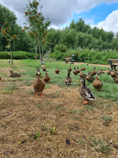

    
    

Hello! I am a fourth year Ph.D. student at the [University of Connecticut](http://www.uconn.edu), working under the supervision of [Keith Conrad](https://kconrad.math.uconn.edu).

Here is a puppy picture:

My CV is [here](cv.pdf)

- here is a list of items
- with more than one
- element. 

this is *italic* and this is **bold**